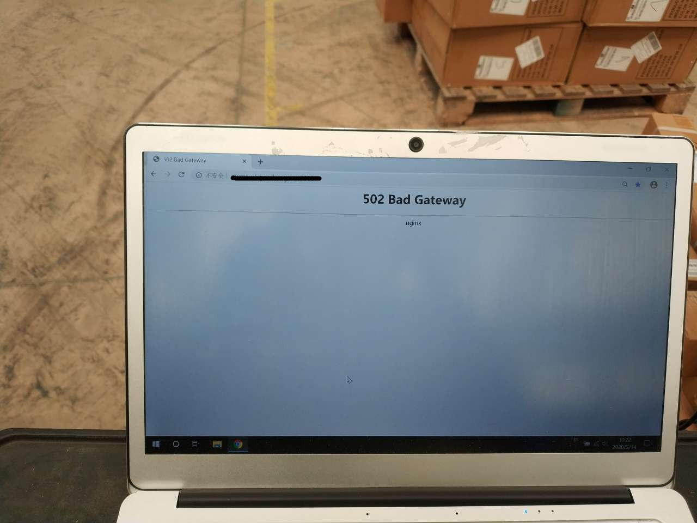

现有的系统架构基于nginx 网关反向代理 +  web服务器使用apache + php + mysql 阿里云RDS

现有方案考虑更换成 nginx 网关反向代理 + web服务器 nginx + php-fpm +php + mysql  阿里云RDS

PHP 7.0版本 apache 2.4版本

## 问题

1. 发布代码可能导致系统出现502
2. 请求web服务器,会出现大量的CLOSE_WAIT状态的tcp请求,请求量大的情况下,会导致连接池占满,无法处理请求,服务器出现502
3. 请求web服务器,有概率出现502
4. apache存在错误,进程异常退出,php模块异常,内存泄漏等问题

问题1 - 发布出现502

 

问题2 - 大量请求502  - grafana 分析web服务器的性能日志大量CLOSE_WAIT tcp进程,占用链接池

问题3 - 请求随机502 - kibana分析apache访问日志,随机502

问题4 -  apache错误日志

## 解决方案

1 停用apache,使用php-fpm替换

2 PHP程序使用的curl,有close,可以排除应用问题,可能是apache底层问题或者PHP模块插件问题

3 CLOSE_WAIT严重占用端口,限制了服务器的访问上限,最终可能导致web不可用

理由,FPM更稳定,支持更大的请求,apche不是问题太多,无法彻底解决问题

